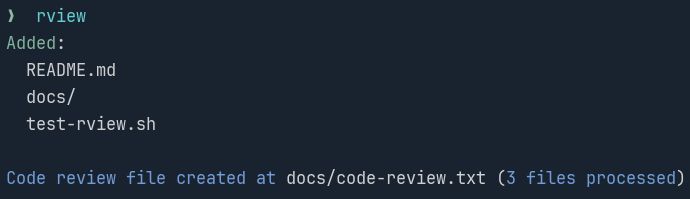

# rview



> A simple CLI tool for AI-assisted code review that aggregates modified files into a single review file.

It automatically detects modified files in your git repository and combines them into a single, well-formatted file that's perfect for AI reviewers to analyze your code changes.

## Features

- 🔍 **Git Integration** - Automatically detects modified and untracked files
- 🎯 **Smart Filtering** - Exclude files with glob patterns (`*.log`, `dist/`, etc.)
- 🎨 **Colored Output** - Clear visual feedback
- ⚡ **Blazing Fast & Lightweight** - Minimal dependencies, maximum performance

## Installation

### Quick Install

```bash
# Clone and install
git clone <repository-url>
cd rview
./install.sh
```

The install script will:

- Build the project in release mode
- Install to `~/.local/bin/rview`
- Check if `~/.local/bin` is in your PATH
- Provide setup instructions if needed

### Manual Installation

```bash
# Build manually
cargo build --release

# Copy to desired location
cp target/release/rview ~/.local/bin/
```

### Uninstall

```bash
./uninstall.sh
```

## Usage

### Basic Usage

```bash
# Review all modified files
# By default the file is located in docs/code-review.txt
rview

# Custom output file
rview -o my-review.txt

# Exclude specific files/patterns
rview -x "*.lock,dist/,*.log"

# Show excluded files (verbose mode)
rview --verbose
```

### Command Line Options

```
rview [OPTIONS]

Options:
  -o, --output <FILE>       Output file path [default: docs/code-review.txt]
  -x, --exclude <PATTERNS>  Exclude file patterns (comma-separated)
  -v, --verbose             Show excluded files in output
  -h, --help                Print help
  -V, --version             Print version
```

## Examples

### Basic Code Review

```bash
# Generate review file for all changes
rview
```

**Output:**

```
Added:
  src/main.rs
  src/config.rs
  README.md

Code review file created at docs/code-review.txt (3 files processed)
```

### Exclude Build Artifacts

```bash
# Exclude common noise files
rview -x "*.lock,target/,node_modules/,dist/"
```

### Custom Output Location

```bash
# Save to custom location
rview -o reviews/$(date +%Y%m%d)-changes.txt

rview -o specs/changes.txt

rview -o to-review.txt
```

### Verbose Mode

```bash
# See what files were excluded with `--verbose` or `-v` flags
rview -x "*.json,*.md" --verbose
```

**Output:**

```
Added:
  src/main.rs
  src/lib.rs

Excluded:
  package.json
  README.md

Code review file created at docs/code-review.txt (2 files processed)
```

## Output Format

The generated review file uses a clean, AI-friendly format:

```txt
========== src/main.rs ==========
fn main() {
    println!("Hello, world!");
}

========== src/lib.rs ==========
pub fn add(a: i32, b: i32) -> i32 {
    a + b
}
```

## Integration Examples

### Pre-commit Hook

```bash
#!/bin/sh
# .git/hooks/pre-commit
rview -o .git/review.txt
echo "Review file updated at .git/review.txt"
```

### Development Workflow

```bash
# Make your changes so rview knows what to grab

# Generate review before commit
rview -x "*.lock,target/" -o temp-review.txt

# Send to your AI assistant

# Clean up
rm temp-review.txt
```

## How It Works

1. **Git Detection** - Runs `git status --porcelain` to find modified files
2. **Smart Filtering** - Applies exclude patterns to filter unwanted files
3. **File Aggregation** - Reads and combines file contents with clear separators
4. **Output Generation** - Creates output directory if needed, handles errors gracefully

## Requirements

- Git repository (tool must be run from within a git repo)
- Rust 1.70+ (for building from source)

## File Exclusions

Files matching your `.gitignore` are automatically excluded by git.

Additional exclusions can be specified with the `-x` flag using comma-separated glob patterns:

- `*.log` - All log files
- `target/` - Rust build directory
- `package*` - Package files (package.json, package-lock.json)

Example: `rview -x "*.log,target/,package*"`

## Troubleshooting

### "Not in a git repository"

Make sure you're running `rview` from within a git repository.

### "No modified files found"

This means git doesn't see any changes. Try:

- `git status` to verify
- Make some changes or add new files
- Check if files are already committed

### Colors not showing

Colors are automatically disabled when:

- Output is piped to a file
- Terminal doesn't support colors
- Running in non-interactive mode

## Contributing

This is a simple tool focused on doing one thing well. Contributions are welcome for:

- Bug fixes
- Performance improvements
- Better error handling
- Cross-platform compatibility

## License

MIT License - see LICENSE file for details.

## Why rview?

**For AI-Assisted Development:**

- Provides clean context to AI reviewers
- Eliminates need to copy-paste multiple files
- Standardized format across projects
